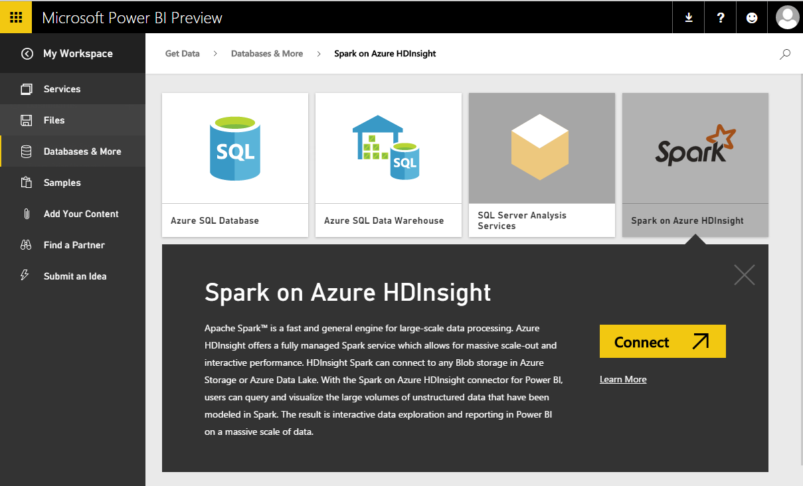
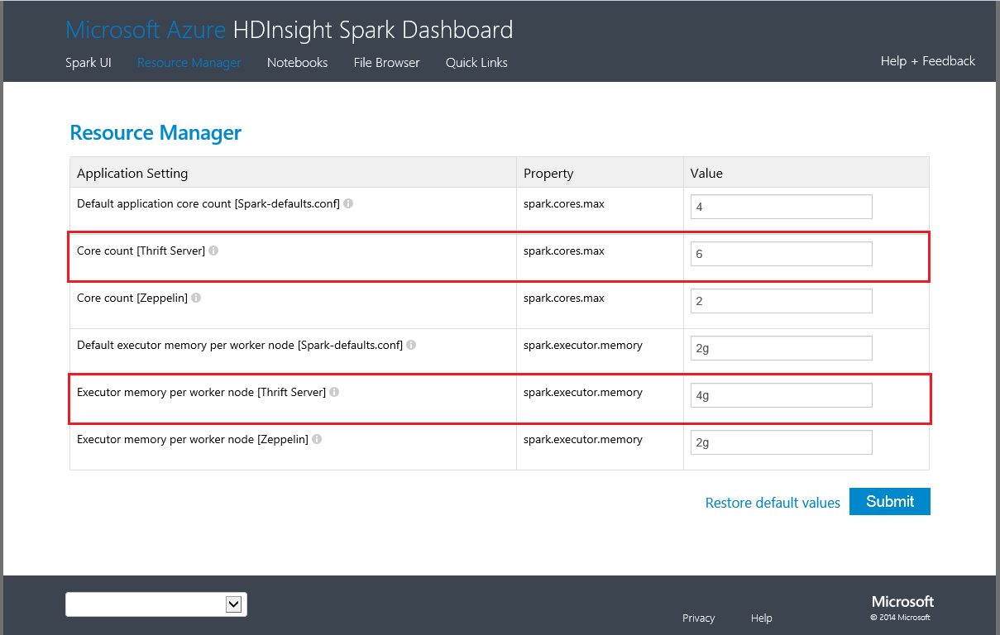

<properties
   pageTitle="Spark on HDInsight with DirectQuery"
   description="Spark on HDInsight with DirectQuery"
   services="powerbi"
   documentationCenter=""
   authors="guyinacube"
   manager="mblythe"
   backup=""
   editor=""
   tags=""
   qualityFocus="no"
   qualityDate=""/>

<tags
   ms.service="powerbi"
   ms.devlang="NA"
   ms.topic="article"
   ms.tgt_pltfrm="NA"
   ms.workload="powerbi"
   ms.date="09/09/2016"
   ms.author="asaxton"/>

# Spark on HDInsight with DirectQuery

Spark on Azure HDInsight with DirectQuery allows you to create dynamic reports based on data and metric you already have in your Spark cluster. With DirectQuery, queries are sent back to your Azure HDInsight Spark cluster as you explore the data in the report view. This experience is suggested for users who are familiar with the entities they connect to.

> [AZURE.WARNING] Automatic tile refresh has been disabled for dashboard tiles built on Spark based datasets. You can select <bpt id="p1">**</bpt>Refresh Dashboard Tiles<ept id="p1">**</ept> to refresh manually. Reports are not impacted and should remain up-to-date. 

-   Every action such as selecting a column or adding a filter will send a query back to the database – before selecting very large fields, consider choosing an appropriate visual type.
-   Q&amp;A is not available for DirectQuery datasets.
-   Schema changes are not picked up automatically.
-   Groups are only available with <bpt id="p1">[</bpt>Power BI Pro<ept id="p1">](powerbi-power-bi-pro-content-what-is-it.md)</ept>.

These restrictions and notes may change as we continue to improve the experiences. The steps to connect are detailed below.  Additional documentation can be found at <bpt id="p1">[</bpt>Use BI tools with Apache Spark on Azure HDInsight<ept id="p1">](https://azure.microsoft.com/documentation/articles/hdinsight-apache-spark-use-bi-tools/)</ept>

1. Select <bpt id="p1">**</bpt>Get Data<ept id="p1">**</ept> at the bottom of the left navigation pane.  
      

2. Select <bpt id="p1">**</bpt>Databases &amp; More<ept id="p1">**</ept>.  
    

3. Select the <bpt id="p1">**</bpt>Spark on HDInsight<ept id="p1">**</ept> connector and choose <bpt id="p2">**</bpt>Connect<ept id="p2">**</ept>.  
      

4. Enter the name of the <bpt id="p1">**</bpt>server<ept id="p1">**</ept> you want to connect to, as well as your <bpt id="p2">**</bpt>username<ept id="p2">**</ept> and <bpt id="p3">**</bpt>password<ept id="p3">**</ept>. The server is always in the form <ph id="ph1">\&lt;</ph>clustername<ph id="ph2">\&gt;</ph>.azurehdinsight.net, see more details about finding these values below.  
      

5. Once connected, you'll see a new dataset with named “SparkDataset”. You can also access the dataset through the placeholder tile that is created.  
      

6. Drilling into the dataset, you can explore all of the tables and columns in your database. Selecting a column will send a query back to the source, dynamically creating your visual. These visuals can be saved in a new report, and pinned back to your dashboard.

## Finding your Spark on HDInsight parameters  
The server is always in the form <ph id="ph1">\&lt;</ph>clustername<ph id="ph2">\&gt;</ph>.azurehdinsight.net, and can be found in your portal:  
    

The username and password can also be found in the portal.

## Solucionar problemas  
If you're hitting issues executing queries against your cluster, verify the application is still running and restart if necessary.

You can also allocate additional resources in the Resource Manager:  
    

## Consulte también  

[Get started with Power BI](powerbi-service-get-started.md)  
[Get Data for Power BI](powerbi-service-get-data.md)  
More questions? [Try the Power BI Community](http://community.powerbi.com/)