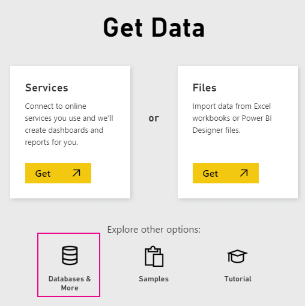

<properties
   pageTitle="Spark en HDInsight con DirectQuery"
   description="Spark en HDInsight con DirectQuery"
   services="powerbi"
   documentationCenter=""
   authors="guyinacube"
   manager="mblythe"
   backup=""
   editor=""
   tags=""
   qualityFocus="no"
   qualityDate=""/>

<tags
   ms.service="powerbi"
   ms.devlang="NA"
   ms.topic="article"
   ms.tgt_pltfrm="NA"
   ms.workload="powerbi"
   ms.date="09/09/2016"
   ms.author="asaxton"/>

# Spark en HDInsight con DirectQuery

Spark en HDInsight de Azure con DirectQuery le permite crear informes dinámicos basados en datos y métrica que ya tiene en el clúster Spark. Con DirectQuery, las consultas se envían a su clúster de Azure HDInsight Spark como explorar los datos en la vista de informe. Se sugiere esta experiencia para los usuarios familiarizados con las entidades que se conectan a.

> [AZURE.WARNING] Actualización automática del mosaico se ha deshabilitado para los iconos de panel basados en conjuntos de datos en función de Spark. Puede seleccionar **Actualizar iconos de panel** para actualizar manualmente. Los informes no se ven afectados y deben permanecer actualizados. 

-   Cada acción, como seleccionar una columna o agregar un filtro se enviar una consulta a la base de datos antes de seleccionar los campos muy grandes, considere la posibilidad de elegir el tipo adecuado visual.
-   Preguntas y respuestas no está disponible para conjuntos de datos de DirectQuery.
-   Cambios de esquema no se recogen automáticamente.
-   Sólo están disponibles con grupos [Power BI Pro](powerbi-power-bi-pro-content-what-is-it.md).

Estas restricciones y notas pueden cambiar mientras seguimos mejorando las experiencias. A continuación, se indican los pasos para conectarse.  Puede encontrar documentación adicional en [Herramientas de BI de uso con Apache Spark en HDInsight de Azure](https://azure.microsoft.com/documentation/articles/hdinsight-apache-spark-use-bi-tools/)

1. Seleccione **obtener datos** en la parte inferior del panel de navegación izquierdo.  
      

2. Seleccione **bases de datos y más**.  
    

3. Seleccione el **Spark en HDInsight** conector y elija **Conectar**.  
      

4. Escriba el nombre de la **server** que desee conectarse, así como su **nombre de usuario** y **contraseña**. El servidor está siempre en el formulario \<clustername\>. azurehdinsight.net, ver más detalles acerca de cómo encontrar estos valores que se indican a continuación.  
      

5. Una vez conectado, verá un nuevo conjunto de datos con el nombre "SparkDataset". El conjunto de datos también puede tener acceso mediante el icono de marcador de posición que se crea.  
      

6. Explorar en el conjunto de datos, puede explorar todas las tablas y columnas en la base de datos. Seleccione una columna enviará una consulta en el origen, creando dinámicamente su visual. Estos objetos visuales pueden guardados en un informe nuevo y se vuelven a Anclar al panel.

## Buscar su Spark en HDInsight parámetros  
El servidor está siempre en el formulario \<clustername\>. azurehdinsight.net y puede encontrarse en el portal:  
    

El nombre de usuario y la contraseña también se encuentra en el portal.

## Solucionar problemas  
Si se llega a problemas de ejecución de consultas en el clúster, compruebe que la aplicación sigue en ejecución y reinicie si es necesario.

También pueden asignar recursos adicionales en el Administrador de recursos:  
    

## Consulte también  

[Introducción a Power BI](powerbi-service-get-started.md)  
[Obtener datos para Power BI](powerbi-service-get-data.md)  
¿Preguntas más frecuentes? [Pruebe la Comunidad de Power BI](http://community.powerbi.com/)