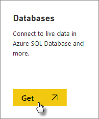
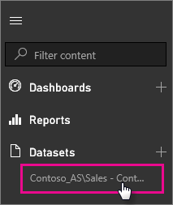

<properties
   pageTitle="SQL Server Analysis Services live data in Power BI"
   description="SQL Server Analysis Services live data in Power BI. This is done via a data source that was configured for an enterprise gateway."
   services="powerbi"
   documentationCenter=""
   authors="guyinacube"
   manager="mblythe"
   backup=""
   editor=""
   tags=""
   qualityFocus="no"
   qualityDate=""/>

<tags
   ms.service="powerbi"
   ms.devlang="NA"
   ms.topic="article"
   ms.tgt_pltfrm="NA"
   ms.workload="powerbi"
   ms.date="09/21/2016"
   ms.author="asaxton"/>
# SQL Server Analysis Services live data in Power BI

In Power BI, there are two ways you can connect to a live SQL Server Analysis Services server. In Get data, you can connect to a SQL Server Analysis Services server, or you can connect to a <bpt id="p1">[</bpt>Power BI Desktop file<ept id="p1">](powerbi-service-powerbi-desktop-files.md)</ept>, or <bpt id="p2">[</bpt>Excel workbook<ept id="p2">](powerbi-service-excel-data.md)</ept>, that already connects to an Analysis Services server. 

  **Importante:**

-   In order to connect to a live Analysis Services server, an On-premises Data Gateway must be installed and configured by an administrator. For more information, see <bpt id="p1">[</bpt>On-premises Data Gateway<ept id="p1">](powerbi-gateway-onprem.md)</ept>.

-   When you use the gateway, your data remains on-premises.  The reports you create based on that data are saved in the Power BI service. 

-   <bpt id="p1">[</bpt>Q&amp;A natural language querying<ept id="p1">](powerbi-service-q-and-a-direct-query.md)</ept> is in preview for Analysis Services live connections.

> [AZURE.NOTE] Working with live Analysis Services servers, along with Groups, are Pro features. [Obtener más información](powerbi-power-bi-pro-content-what-is-it.md)

## To connect to a model from Get data

1.  In <bpt id="p1">**</bpt>My Workspace<ept id="p1">**</ept>, select <bpt id="p2">**</bpt>Get data<ept id="p2">**</ept>. You can also change to a group workspace, if one is available.

    

2.  Select <bpt id="p1">**</bpt>Databases &amp; More<ept id="p1">**</ept>.

    

3.  Select <bpt id="p1">**</bpt>SQL Server Analysis Services<ept id="p1">**</ept><ph id="ph1"> &gt; </ph><bpt id="p2">**</bpt>Connect<ept id="p2">**</ept>. 

    

4.  Seleccione un servidor. If you don't see any servers listed here, it means either a gateway, and data source, are not configured, or your account is not listed in the <bpt id="p1">**</bpt>Users<ept id="p1">**</ept> tab of the data source, in the gateway. Check with your adminsitrator.

5.  Select the model you want to connect to. This could be either Tabular or Multidimensional.

After you connect to the model, it will appear in your Power BI site in <bpt id="p1">**</bpt>My Workspace/Datasets<ept id="p1">**</ept>. If you were swtiched to a group workspace, then the dataset will appear within the group.

If you pin visuals from a report to the dashboard, the pinned tiles are automatically refreshed every 10 minutes. If the data in your on-premises Analysis Services server is updated, the tiles will get auto-updated after 10 minutes.

## Consulte también

[On-premises Data Gateway](powerbi-gateway-onprem.md)  
[Manage Analysis Services data sources](powerbi-gateway-enterprise-manage-ssas.md)  
[Troubleshooting the On-premises Data Gateway](powerbi-gateway-onprem-tshoot.md)  
More questions? [Try the Power BI Community](http://community.powerbi.com/)