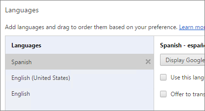

<properties 
   pageTitle="Idiomas admitidos y los países o regiones para Power BI"
   description="Idiomas admitidos y los países o regiones para Power BI"
   services="powerbi" 
   documentationCenter="" 
   authors="maggiesMSFT" 
   manager="erikre" 
   backup=""
   editor=""
   tags=""
   qualityFocus="monitoring"
   qualityDate="05/02/2016"/>
 
<tags
   ms.service="powerbi"
   ms.devlang="NA"
   ms.topic="get-started-article"
   ms.tgt_pltfrm="NA"
   ms.workload="powerbi"
   ms.date="10/14/2016"
   ms.author="maggies"/>
# Idiomas admitidos y los países o regiones para Power BI

Para los países y regiones donde no está disponible, Power BI, consulte este [lista disponibilidad internacional](https://products.office.com/business/international-availability). 

## Idiomas para el servicio Power BI

El servicio Power BI (en el explorador) está disponible en los siguientes 42 idiomas:

-   Árabe
-   Vasco - Vasco
-   Búlgaro - Български
-   Catalán - català
-   Chino (simplificado): 中文(简体)
-   Chino (tradicional) - 中文(繁體)
-   Croata - hrvatski
-   Checo - čeština
-   Danés - dansk
-   Neerlandés - Países Bajos
-   Inglés - inglés
-   Estonio - eesti
-   Finés - suomi
-   Francés - français
-   Gallego - galego
-   Alemán - Deutsch
-   Griego - Ελληνικά
-   Hebreo
-   Hindi - हिंदी
-   Húngaro - Magiar
-   Indonesio - Indonesio
-   Italiano - italiano
-   Japonés - 日本語
-   Kazaj - Қазақ
-   Coreano - 한국어
-   Letón - latviešu
-   Lituano - lietuvių
-   Malayo - Bahasa Melayu
-   Noruego (Bokmal) - versión Noruega (bokmål)
-   Polaco - Polski
-   Portugués (Brasil) - Português
-   Portugués (Portugal) - português
-   Rumano - română
-   Ruso - Русский
-   Serbio (cirílico) - српски
-   Serbio (latino) - srpski
-   Eslovaco - slovenčina
-   Esloveno - slovenski
-   Español - español
-   Sueco - versión sueca
-   Thai - ไทย
-   Turco - Türkçe
-   Ucraniano - українська
-   Vietnamita - Tiếng Việt

## Lo que se traduce.

Menús, botones, mensajes y otros elementos de la experiencia se traducen a su idioma, facilitando la navegue e interactúe con Power BI.

En este momento, algunas características sólo están disponibles en inglés:

-   Paneles e informes que Power BI crea automáticamente cuando se conecta a servicios como Microsoft Dynamics CRM, Google Analytics, Salesforce y así sucesivamente. (Puede seguir crear sus propios informes y paneles en su propio idioma.)

-   Explorar los datos con preguntas y respuestas.

Permanezca atento a medida que trabajamos para poner características adicionales en otros idiomas. 

## Elija el idioma en el servicio Power BI

1. En el servicio Power BI, seleccione la **configuración** icono  > **configuración**.

2. En la **General** ficha > **lenguaje**.

3. Seleccione su idioma > **aplicar**.

## Elija el idioma en el explorador

Power BI detecta el idioma basándose en las preferencias de idioma en el equipo. La forma de obtener acceso y cambiar estas preferencias puede variar según el sistema operativo y el explorador. A continuación le mostramos cómo obtener acceso a estas preferencias de Internet Explorer y Google Chrome.

### Internet Explorer (versión 11)

1.  Haga clic en el botón herramientas en la esquina superior derecha de la ventana del explorador:

    

2.  Haga clic en **Opciones de Internet**.

3.  En el cuadro de diálogo Opciones de Internet, en la ficha General, en apariencia, haga clic en el **idiomas** botón.

### Google Chrome (versión 42)

1.  Haga clic en el botón de menú en la esquina superior derecha de la ventana del explorador:

    

2.  Haga clic en **Configuración**.

3.  Haga clic en **Mostrar configuración avanzada**.

4.  En los idiomas, haga clic en la **idioma y la configuración de entrada** botón.

5.  Haga clic en **Agregar**, seleccione un idioma y haga clic en **Aceptar**.

    

    El nuevo lenguaje está al final de la lista. 

6.  Arrastre el nuevo idioma a la parte superior de la lista y haga clic en **Mostrar Google Chrome en este idioma**.

    

    Debe cerrar y volver a abrir el explorador para ver el cambio.

## Elija su idioma cuando descargue Power BI Desktop

Tiene la opción de seleccionar un idioma al descargar Power BI Desktop. 

-  Vaya a la [página de descarga de Power BI Desktop](https://www.microsoft.com/download/details.aspx?id=45331).

La única manera de cambiar el idioma en Power BI Desktop es volver a la página de descarga y descargar en un idioma diferente.

## Elija la configuración regional de un informe en Power BI Desktop

Puede establecer la configuración regional (los formatos de fecha y número) de un informe específico sea distinto de la configuración regional de la versión de Power BI Desktop. 

1.  Vaya a **archivo** > **Opciones y configuración** > **opciones**.
2.  Bajo **archivo actual**, seleccione **de carga de datos**.
3.  En el **Configuración regional** seleccione una configuración regional diferente. 

    

## Idiomas para la documentación de ayuda

Ayuda está traducida a estos 10 idiomas: 

-   Chino (simplificado): 中文(简体)
-   Chino (tradicional) - 中文(繁體)
-   Francés - français
-   Alemán - Deutsch
-   Italiano - italiano
-   Japonés - 日本語
-   Coreano - 한국어
-   Portugués (Brasil) - Português
-   Ruso - Русский
-   Español - español

### Consulte también 
Pruebe a formular la [Power BI Comunidad](http://community.powerbi.com/).

