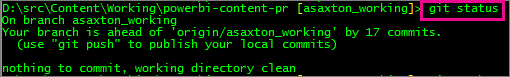
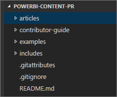
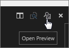
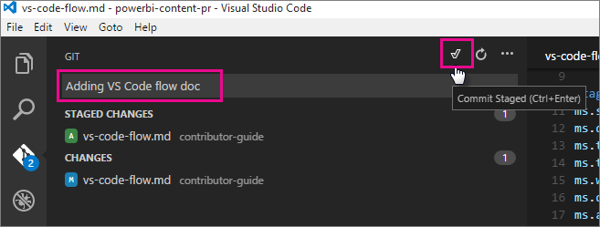

<properties
pageTitle="Código de Visual Studio - flujo"
description="Tutorial sobre cómo utilizar código de Visual Studio con el repositorio de Power BI."
services=""
documentationCenter=""
authors="guyinacube"
manager="mblythe"
editor=""/>

<tags
ms.service="contributor-guide"
ms.devlang=""
ms.topic="article"
ms.tgt_pltfrm=""
ms.workload=""
ms.date="11/09/2015"
ms.author="asaxton"/>

# Código de Visual Studio - flujo

Esto le guiará a través de cómo puede utilizar código de Visual Studio con el repositorio Git de Power BI. Puede descargar código de VS desde https://code.visualstudio.com/.

## Ventajas

Hay algunas ventajas de utilizar código de Visual Studio en lugar de otra herramienta, como ATOM.  Principalmente debido a la integración de Git que hace que el proceso un poco Suavizador y le permite trabajar en una sola herramienta para la mayoría de las actividades. También hay una sección de archivos de trabajo lo que es bueno pasar por alto los otros artículos.

## Actualice su reproducción local en primer lugar

Necesitará usar la línea de comandos Git para algunas operaciones.  El primero de ellos es que debemos hacer una extracción siempre antes de comenzar a realizar cambios.  Esto asegura que la bifurcación de repositorio está en consonancia con la bifurcación principal Azure principal.

Para extraer las actualizaciones de Azure y Power BI-contenido-pr, ejecute el siguiente comando.

    git pull Azure master
    

 
Verá **Azure** descrita en el comando anterior.  En su caso, puede ser **ascendente**.  Obtendrá un error que indica que no existe.  Además, es *entre mayúsculas y minúsculas*!  Puede comprobar lo que usted está realizando un *git remoto mostrar*.

Es una buena idea para ejecutar un comando de estado para asegurarse de que se están sincronizados.

    git status

En este caso, era el repositorio local de **origen**.

Como indica, hagamos un **inserción** y **origen** debe coincidir con el repositorio local.  

    git push

## Carpeta local

Se supone que ya ha clonado la reproducción en el equipo y se encuentra en una carpeta local. 

Después de abrir VS Code, vaya a **archivo** > **Abrir carpeta...**.  Seleccione la carpeta de clon local.  Esto mostrará todos los archivos en esa estructura.

## Archivos de trabajo

Al editar archivos, se muestren en la **archivos de trabajo** sección. Puede quitarlos de archivos de trabajo, haga clic en la X junto a ella.  

Esta lista se conservará como abrir y cerrar VS Code. Es una forma de mano para centrarse en los archivos que ganó y omitir el resto como ruido. La única desventaja de esta área es que no se puede cambiar su tamaño.

## Vista previa de descuento

Puede ver la vista previa del descuento, realice una de las siguientes acciones.

- Haga clic en un archivo y seleccione **vista previa abierto**.

    

- Seleccione el **vista previa abierto** icono en la esquina superior derecha, cuando tenga el artículo abierto.

    

## Confirmaciones de GIT

Esto es donde el código de VS es bueno.  Cuando realice cambios, VS Code realizará el seguimiento de los cambios que realice para fines de registro.  Cambiar elementos, el icono de Git, a la izquierda, tendrá un indicador de número junto a lo que muestra el número de cambios.

Seleccionar ese icono nos mostrará la lista de cambios.

Puede seleccionar la **+** en la **cambios** barra desplazando el puntero sobre él.  O bien, puede seleccionar una **+** junto a cada archivo individual que desea confirmar.  Seleccionar la **+** le *fase* el archivo.

Una vez que los archivos de ensayo, puede agregar un comentario en el cuadro de mensaje y, a continuación, seleccione el icono de verificación.  El icono de marca de verificación realmente hará que la acción de confirmación de Git.

## Volver a insertar los archivos en GitHub

Una vez que se han confirmado algunos archivos, necesitará volver atrás en el shell de comandos de git y el problema una **inserción** comando que se envía a GitHub.

    git push

Puede mantener volviendo a la inserción, commit y editar archivos mientras trabaja.

## Solicitud de extracción

Una vez haya don con todos los cambios, debe emitir una **solicitud de extracción** que se realiza en el propio sitio de GitHub.

